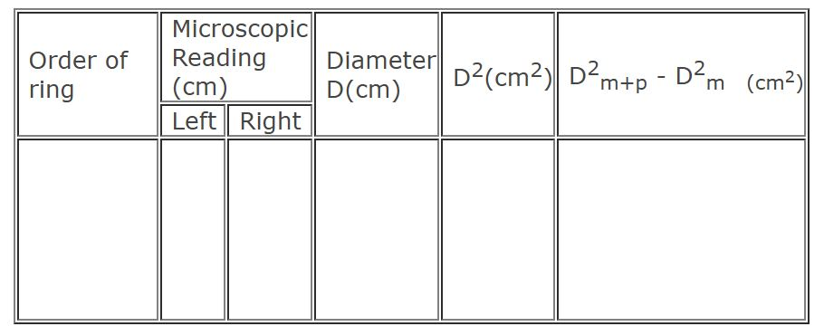

### Procedure

### Performing Real Lab

After experimental arrangement, the glass plate is inclined at an angle $45^{0}$ to the horizontal.This glass plate reflects light from the source vertically downwards and falls normally on the convex lens. Newton's rings are seen using a long focus microscope, focussed on the air film. The cross-wire of the microscope is made tangential to the 20th ring on the left side of the centre. The readings of the main scale and vernier scale of the microscope are noted. The cross wire is adjusted to be tangential to the 18th, 16th, 14th,&nbsp; etc on the left and 2nd, 4th, 6th, etc on the right and readings are taken each time. From this the diameter of the ring is found out which is the difference between the readings on the left and right sides. The square of the diameter and hence Dn2 and D2n+m are found out. Then wavelength is calulated using equation.

### Performing the simulation

The simulation virtualizes the Newton's rings experiment. The user can view the effect of Newton's rings formed when the medium changes. Select any one type of medium. Different ring pattern can be seen by changing the radius of curvature of the lens and wavelength of light source.
### Components:
 
Start button, Light source, Filter, Microscope, Lens, Medium and Glass plate.

#### Help:
 
**Variable region:**
1. Choose Medium Combo box helps you to choose the type of medium that the simulation have to perform.
2. Radius Slider helps to change the radius of curvature of lens.
3. The wavelength slider helps to change the wavelength of light used. 

**Measurement region:**
1. The start button will help to play the simulation.
2. The variation in the rings can be seen when the medium,wavelength of light or the radius of the lens changes.

### Procedure

<ol>
    <li>Click on the "light on" button.</li>
    <li>Select the lens of desirable radius.</li>
    <li>Adjust the microscope position to view the Newton rings.</li>
    <li>Focus the microscope to view the rings clearly.</li>
    <li>Fix the cross-wire on 20th ring either from right or left &nbsp;of the centre dark ring and take the readings .</li>
    <li>Move the crosswire and take the reading of 18th,16th...........2nd ring.</li>
    <li>You have to take the reading of rings on either side of the centre dark ring.</li>
    <li>Enter the readings in the tabular column.</li>
    <li>Calculate the&nbsp;wavelength of the source  by using the  given formula.</li>
</ol>

### Observations

**To find Least Count**

One main scale division                     = ............... cm

Number of divisions on Vernier          = ...............

L.C.  = One main scale division/ Number of division on vernier=.................................

## Calculation

Mean value of $D^{2}_{m+p}-D^{2}_{m}$ = ......... cm2

Wavelength of light $ \lambda=\frac{D^{2}_{m+p}-D^{2}_{m}}{4pR}$ = .................... nm

## Result:

Wavelength of light from the given source is found to be  = ..........nm
