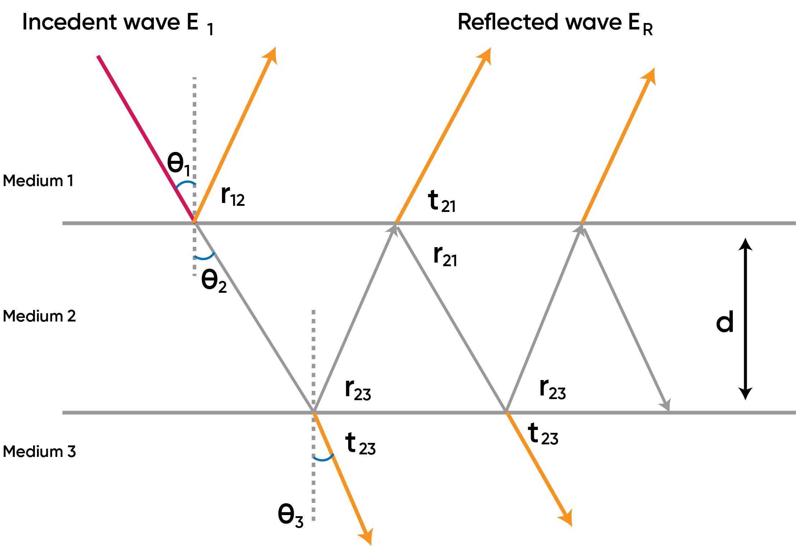
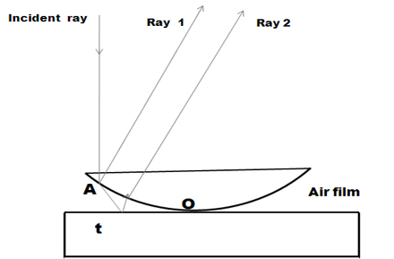

### Theory

<iframe width="560" height="315" src="https://www.youtube.com/embed/PU-SeNfIRcs" frameborder="0" allow="autoplay; encrypted-media" allowfullscreen></iframe>

### Thin film interference

A film is said to be thin when its thickness is about the order of one wavelength of visible light which is taken to be 550 nm.  When light is incident on such a film, a small portion gets reflected from the upper surface and a major portion is transmitted into the film. Again a small part of the transmitted component is reflected back into the film by the lower surface and the rest of it emerges out of the film. These reflected beams reunite to produce interference.  Also the transmitted beams too interfere.  This type of interference that takes place in thin films is called interference by division of amplitude.

  
Figure 1: schematic representation of reflected and transmitted rays from a thin film
 

$\theta_{1}$   angle of incidence at medium 1 to medium 2 boundary. 
$\theta_{2}$    angle of refraction at medium 1 to medium 2 boundary. 
$\theta_{3}$    angle of refraction at medium 2 to medium 3 boundary. 
$r_{12}$    reflected light from medium 1 to medium 2 boundary. 
$r_{23}$    reflected light from medium 2 to medium 1 boundary. 
$r_{21}$    reflected light from medium 2 to medium 3 boundary. 
$t_{21}$    transmitted light from medium 2 to medium 1 boundary. 
$t_{23}$    transmitted light from medium 2 to medium 3 boundary. 
$d$       thickness of the film. 

In the above figure the rays $r_{12}$ and $t_{21}$ interfere and results in a constructive or destructive interference depending on their path differences, given as,

**constructive interference**  

$$2\mu_{2}d\cos r_{12}=(2m+1)\frac{\lambda}{2}$$

**destructive interference**  

$$2\mu_{2}d\cos r_{12}=m\lambda$$

Where, $\mu_{2}$: refractive index of the  medium 2 and  $m=0,1,2,...$   the order of interference.
The transmitted light from $t_{23}$ can also interfere and result in constructive or destructive interference.

### Thin film interference with films of varying thickness (Newton's rings):

  
Figure 2: arrangement of plano-convex lens and plane glass for the thin film formation.
 

Rings are fringes of equal thickness.  They are observed when light is reflected from a plano-convex lens of a long focal length placed in contact with a plane glass plate.  A thin air film is formed between the plate and the lens.  The thickness of the air film varies from zero at the point of contact to some value t.  If the lens plate system is illuminated with monochromatic light falling on it normally, concentric bright and dark interference rings are observed in reflected light. These circular fringes were discovered by Newton and are called Newton's rings.

A ray AB incident normally on the system gets partially reflected at the bottom curved surface of the lens (Ray 1) and part of the transmitted ray is partially reflected (Ray 2) from the top surface of the plane glass plate.  The rays 1 and 2 are derived from the same incident ray by division of amplitude and therefore are coherent.  Ray 2 undergoes a phase change of p upon reflection since it is reflected from air-to-glass boundary.

The condition for constructive and destructive interferences are given as; for normal incidence  $\cos r = 1$ and for air film $\mu= 1$.

**constructive interference**

$$2t=(2m+1)\frac{\lambda}{2}$$

**destructive interference**

$$2t=m\lambda$$

1. **Central dark spot**: At the point of contact of the lens with the glass plate the thickness of the air film is very small compared to the wavelength of light therefore the path difference introduced between the interfering waves is zero. Consequently, the interfering waves at the centre are opposite in phase and interfere destructively. Thus a dark spot is produced.
2. **Circular fringes with equal thickness**: Each maximum or minimum is a locus of constant film thickness. Since the locus of points having the same thickness fall on a circle having its centre at the point of contact, the fringes are circular.
3. **Fringes are localized**: Though the system is illuminated with a parallel beam of light, the reflected rays are not parallel. They interfere nearer to the top surface of the air film and appear to diverge from there when viewed from the top. The fringes are seen near the upper surface of the film and hence are said to be localized in the film.
4. Radii of the mth dark rings: $r_{m}=\sqrt{m\lambda R}$
5. Radii of the mth bright rings: $r_{m}=\sqrt{(2m+1)R\frac{\lambda}{2}}$
6. The radius of a dark ring is proportional to the radius of curvature of the lens by the relation, $r_{m} \propto \sqrt{R}$
7. Rings get closer as the order increases (m increases) since the diameter does not increase in the same proportion.
8. In transmitted light the ring system is exactly complementary to the reflected ring system so that the centre spot is bright.
9. Under white light we get coloured fringes.
10. The wavelength of monochromatic light can be determined as,
 
